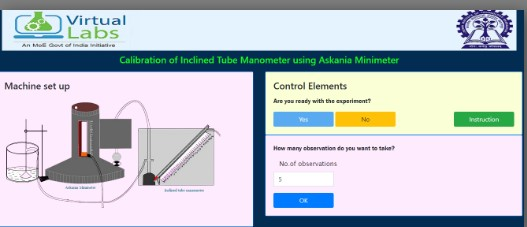
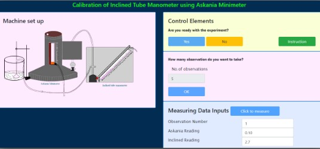
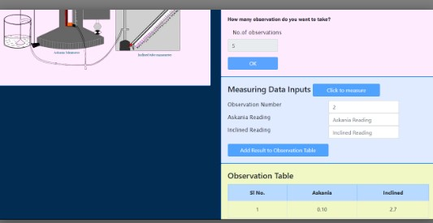
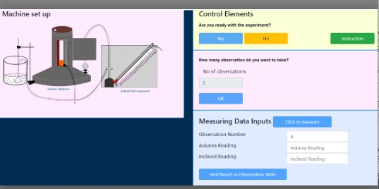
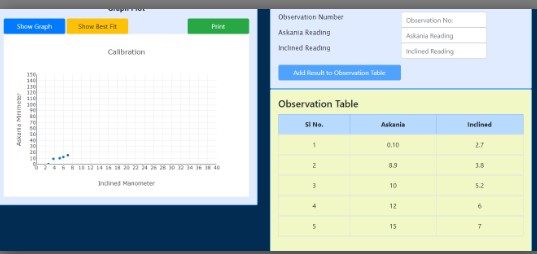
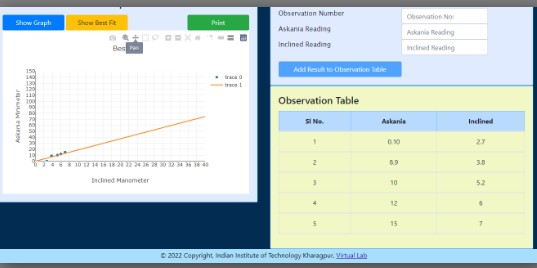

## Procedure

The following procedures are to be followed by the user in order to calibrate the askania minimeter readings:

1. The inclined manometer should be levelled by adjusting the screws at the base of the manometer and with the help of a spirit level.
2. The inclination should be measured with respect to the horizontal line.
3. The Askania minimeter has to be levelled using the spherical spirit level at the base.
4. All have to be connected at the junction, as indicated.
5. The inverted funnel should be dipped into water in the water reservoir. Then water is to be added in steps and removed in steps for varying the pressure head.
6. The top knob should be turned appropriately so that the pin heads match in the Askania minimeter.
7. The readings from Asksnia minimeter, DPCalc (in kPa) and the inclined tube manometer (in mm) have to be noted under respective variable in the prescirbed table.
8. A plot of the readings taken from the Askania minimeter vs. the Inclined tube manometer ; and DPCalc vs. inclined tube manometer has to be plotted.
9. The equations of both the plots should be found out the calculated one and compared one.

The least counts of the two instruments used here are as mentioned below:
Askania minimeter = 0.01 mm WG
Inclined tube manometer = 0.1 cm WG
DPCalc = 0.1 Pa

##  Simulation Procedure

The following procedures are to be followed by the user in order to calibrate the askania minimeter readings:

Start the Experiment by clicking the button "Yes".

Then enter the number of Observations in the input box, the user may want to calibrate, the range is 4 to 20 observation may take.

After that press the "Ok" button to calibrate the measurements of the Askania minimeter and the Inclined tube Manometer. Take the initial readings of these instruments and enter in the input box. This measures the askania and the inclined readings, for first observation.

Then click on the button "Add result to the Observation table" to add the readings in the observation table.

Press the black button in the machine setup "to change the pressure" and click "Click to Measure" for measuring the askania and the inclined readings, for second observation. Enter in the input box.

Continue until the desired number of observations, which is given by the user.

After that the button "Show Graph" is clicked for plotting the graph.

Here add the best fit line by clicking the button "Add Best Fit Line" after that for print the graph press the "Print" button.

