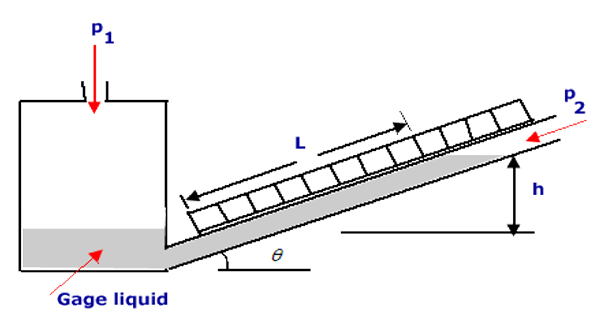
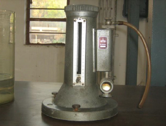
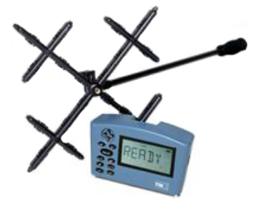
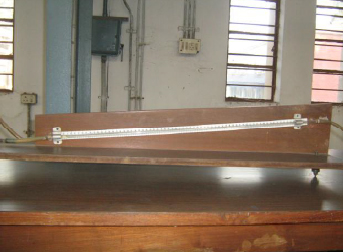
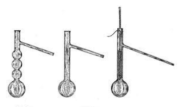
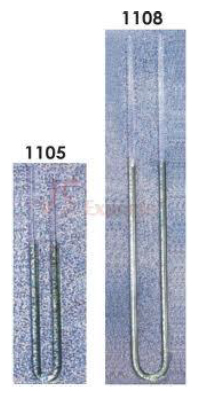

## Theory

**Inclined Tube Manometer:**

Inclined tube manometer is a simple and cheap instrument that is commonly used for measuring differential pressure in a mine. It resembles to a U-tube Manometer. One limb is a tube of uniform bore (6 mm internal diameter) which is kept inclined at a low angle to the horizontal line. The other limb is transformed to a large reservoir with cross-sectional area 300-400 times larger than that of the cross-sectional area of inclined limb. Any change in the level of manometer fluid in the reservoir can be neglected in comparison with the change in fluid level in the inclined tube. Hence, a scale along the inclined limb directly reads pressure difference. For greater sensitivity, the inclined tube manometers can be filled with alcohol which also gives better meniscus than water. The instrument can be made suitable to measure a wide range of pressures by changing the inclination of tube. Smaller angle of inclination can be used for measuring lower range of pressures. In order to make the instrument suitable for use over a large range of pressure, arrangement is made for varying the inclination of the tube. For low-pressure measurements, a low value for the angle of inclination θ is chosen, whereas for measurements in the high-pressure range, the value of θ is increased. The pressure measured by such a manometer is given by the equation:

$$ P_1 = LP_2gsin \theta $$

Where P1= Pressure in Pa, L= Scale reading in mm, P2=Specific gravity of the manometer liquid and θ= Angle of inclination of the tube.

 Figure: Inclined Manometer

For the further study on manometers the following aslo can be referred:

1. Curved-tube manometer
2. wo liquid differential manometer
3. Tilting micromanometer

#### **Askania Minimeter:**
This instrument consists of two inter-communicating containers filled with distilled water. Container f is the observation vessel and N is the balancing vessel. L is the nipple for connecting to the high pressure side and D , to the low pressure side. Vessel N can be raised or lowered by operating the knurled ring P, the amount of movement being noted on the scale r graduated in millimetres and the micrometer scale S having a least count of 0.01 mm.

At the outset the central point of nipple D is brought to the zero of the scale R by turning of the knurled ring P. Cock E is opened and vessel F is filled with water till the pointer G just touches the water level. E is then closed. The pointer is brought to touch the water level exactly by an adjustment of the mild head H, the exact coincidence being observed through the lens K.

The two nipples are then connected to the pressure lines when the level of water in F falls and that in N rises. Now the vessel N is raised turning the knurled ring P until the water level in F again touches the tip of the pointer G ( null point ). The readings on the scale R and the micrometer S then give the pressure in mm.

#### **Measurement of Pressure:**
Though pressure is an absolute quantity, every measurement is made relative to reference like ambient air pressure.

1. **Absolute Pressure:** is referenced to zero(0) against perfect vacuum (=gauge pressure + atmospheric pressure)
2. **Gauge Pressure:** is taken in reference with ambient air pressure.
3. **Differential Pressure:** is the difference in pressure between two points.

## How it works

Take the Askania Minimeter readings and the Inclined Tube manometer readings.

Here Yi be the actual reading of Askania Minimeter and Xi is the reading of inclined manometer. Now error L is given by:

$$ L = \sum (Y_i - mX_i)^2  \ to \ minimize \ L, \frac{\delta L}{\delta M} = 0 $$

$$ \ So \ , \frac{\delta L}{\delta M} = 0 \implies \sum 2(Y_i - mX_i)(-X_i) =0 $$

$$ \implies \frac{ \sum Y_i X_i}{\sum X_i^2} = m $$

Plot the graph for Askania reading and the inclined tube manometer reading Yi and Xi, get the inclination slope from the graph.

## Instruments

1. Askania Minimeter

This is connected directly to the junction where pipes from inclined tube and the micrometer meet. It is used to level the water levels. It has a top knob to increase or decrease the water level in one side so that water level in the other is balanced. It uses a method, similar to the parallax method. Where the head of a straight and an inverted pin are matched. It is leveled before taking any measurements. It has a scale having a main scale and a vernier scale which give the differential pressure. It is less sensitive than a micrometer, but is more precise than the inclined-tube manometer.

2. TSI-DPCal - 8710 (Digital differential pressure calculator):

It is a very sensitive digital instrument to measure differential pressure. It gives readings in Pa, hence keeps varying due to small fluctuations. So one must be careful on handling this instrument that:
  -  No impulsive forces must be given to the instrument
  -  The table it is placed on must be absolutely vibration free

3. Inclined Tube Manometer

It consists of a large reservoir of large area of cross section connected to a measuring limb of smaller cross-section. Higher pressure acting on the reservoir pressed it slightly, but the corresponding rise in level in the measuring limb is magnified by the ratio of their cross sectional areas. The scale graduations designed takes account of slight change in level of the reservoir and are marked directly in pressure or head. The magnification of the inclined tube manometer is equal to the ratio of inclined length per inch water equivalent.

4. Beaker

5. Funnel

6. Tube

## Demo

<!-- blank line -->
<figure class="video_container">
  <iframe src="https://www.youtube.com/embed/Qw4kbBQtoUk" frameborder="0" allowfullscreen="true"> </iframe>
</figure>
<!-- blank line --> 

